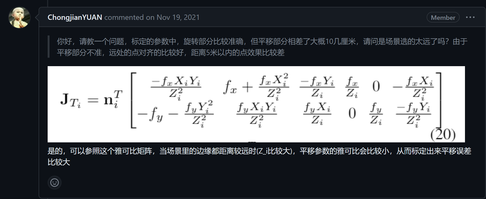

如何标定？
- 首先对相机进行标定

标定尽量用不同角度去拍摄棋盘。
因为对于同一个角度，标定的内参矩阵不会受到棋盘大小的影响，这是显然的，因为所有相互平行的物平面都是相似的，因此任何相似的物体，呈的像都是一致的。
而标定的畸变矩阵会受到棋盘大小的影响。
现象是在尺度变大的时候，畸变矩阵参数会变大，意味着畸变变得更加明显。

- 获得了对相机的标定结果后
填入 calib.yaml 中

- 保持相机和激光雷达绝对位置不变，
获取一张相机的图片

在 livox viewer 中录制一段时间的点云，保存的文件为 .lvx。接下来使用 `roslaunch livox_ros_driver lvx_to_rosbag.launch lvx_file_path:="/path/to/lvx"`，即可转换为 .bag。最后使用 livox_camera_calib 中自带的 bag_to_pcd，即可把 bag 转换成 pcd 文件。

- 最后，准备初始的估计的外参，填入 config_outdoor.yaml 中，然后运行 `roslaunch livox_camera_calib calib.launch` 即可等待结果出现。

### Remarks：
目前项目存在的问题是点云在 rough calibration 之后完全匹配不上，怀疑需要使用更短的焦距的镜头进行标定。
蓝色部分是图片中的 canny 边缘，而红色部分是激光雷达提取的关键轮廓

### 项目日志
第一次尝试：我使用 16mm 的长焦镜头在 C201 教室标定，发现点云和实际图片无法对上，即便是轻质设置初始值让它们粗略地对上了，也会因为奇怪的原因导致最后 optimization 过程中让点云前后前后移动加上等比例缩放，使得标定板被放置在墙上，而非椅子上。

第二次尝试：我使用 5mm 的短焦在 C104 工作间标定，但是最后点云无法和标定板完全重合，和标定板上方方格重合就意味着无法和下方方格重合，可能是标定板有一定的竖直方向上的倾斜，或者是相机的畸变矩阵不够精确导致的问题。

第三次尝试：还是 5mm 短焦，看了官方的 demo 后，打算把场景的尺度进一步扩大，再次进行尝试。然而，这个事情已经有人提到过了。

第四次尝试：
然后我使用了小场景，

结果因为门外被提取了太多雷达点云，然后相机中对应的画面太黑，导致被门外的 edges 带偏了。也可以说这次其实还是不算严格的小场景。

第五次尝试：
将相机面向窗外的部分全部剔除，

这次尝试成功的原因主要是所有物体距离相机和雷达都相对较近，提取的 edge 在横纵两个方向上的分布都较为均匀。但其实如果不调整参数直接给出的结果是有一些偏差的，尤其是数字和棋盘这些关键特征没有对上。我开始考虑可能是参数原因的契机是发现使用 indoor 明显效果比使用 outdoor 好，于是开始观察 indoor 和 outdoor 参数表的主要区别：
- Voxel.size体素大小 indoor 比较小，我们知道，体素越大，降采样后的点云越稀疏，处理速度越快，但精度越低；体素越小，降采样后的点云越密集，处理速度越慢，但精度越高。
根据这个性质，我将体素大小再调小了些

- Edge.min_dis_threshold 是一样的。但是在 issue 中我了解到如果提取到的 edge 过少，会导致不收敛，于是，我按照作者提供的参数，将两者都调大了一些。

- Ransac.dis_threshold 我另外写了一篇文章

后续的尝试：
最近又用这个框架进行了一次标定，发现了一种取巧的方法。如果在可视化中发现在同一区域中，算法自动提取的相机和雷达边缘根本无法对应，我们事实上可以使用 cloudcompare 扣掉对应区域的点云，这样就不会出现因为错误的匹配而产生的偏差了。